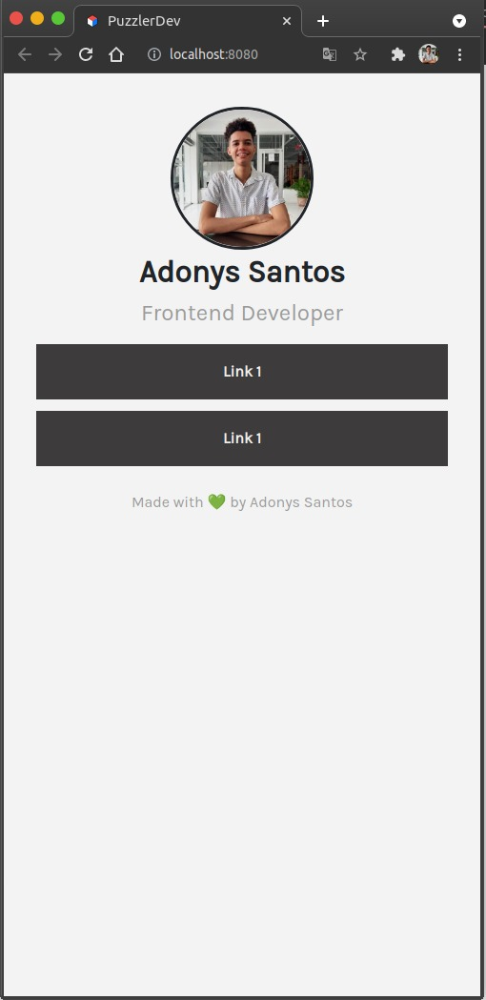

# Linktree React

This is a [Linktree](https://linktr.ee/) clone using React and Sass.

**Live demo:** [adonyssantos.me/puzzlerdev](https://adonyssantos.me/puzzlerdev)

# Table of contents

- [Screenshot](#screenshot)
- [Run this project in development mode](#run-this-project-in-development-mode)
- [Scripts](#scripts)
- [Data](#data)

## Screenshot



## Run this project in development mode

1. Clone your this repo in your local machine, use: `git clone https://github.com/adonyssantos/linktree-react.git`.
2. Move to the repo path, use: `cd linktree-react`
3. Run `npm install` to install the Node Modules.
4. Then run `npm start` in your terminal.

## Scripts

In this project you can run the following Scripts:

### `npm install`

To install the necessary Node modules.

### `npm start`

Run the application in development mode.

### `npm run build`

Create a optimization on the `dist` dir.

### `npm run deploy`

Publish the app with GH Pages.

To deploy update the `homepage` on `package.json`.

```json
 "homepage": ""
```

## Data

The data is obtained from `data.json`.

```json
{
  "header": {
    "image": {
      "url": "",
      "alt": ""
    },
    "fullname": "",
    "title": ""
  },
  "links": [
    {
      "title": "Link 1",
      "url": "",
      "openInNewTab": true
    },
    {
      "title": "Link 1",
      "url": "",
      "openInNewTab": false
    }
  ]
}
```

- `header`, contain the user information (profile pic, full name and title).
- `links`, contain an array with the links data.
